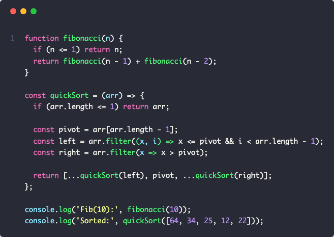
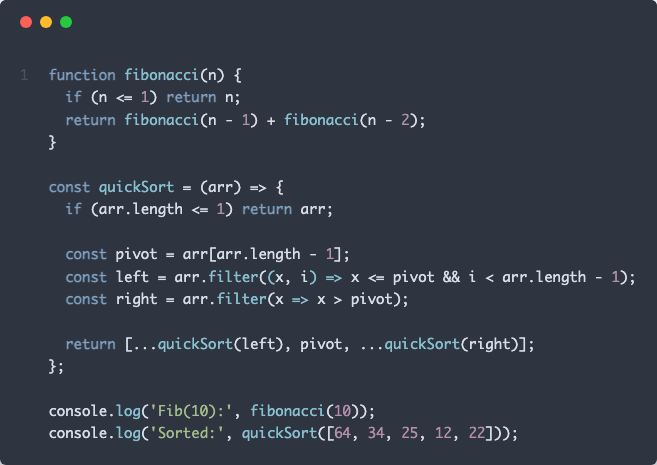
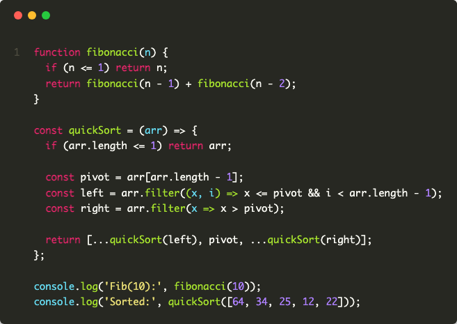
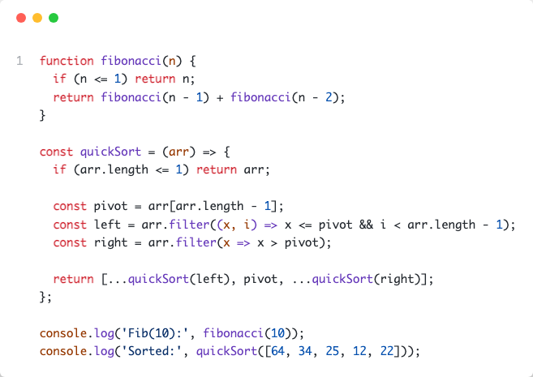
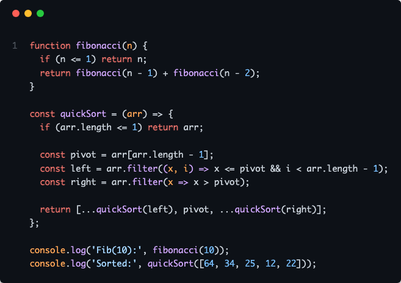

[](https://mseep.ai/app/moussaabbadla-code-screenshot-mcp)

# Code Screenshot Generator MCP

> MCP server for generating beautiful code screenshots directly from Claude

[](https://www.npmjs.com/package/code-screenshot-mcp)
[](https://www.npmjs.com/package/code-screenshot-mcp)
[](https://opensource.org/licenses/MIT)
[](https://www.typescriptlang.org/)
[](https://modelcontextprotocol.io/)

## Overview

A Model Context Protocol (MCP) server that enables Claude to generate syntax-highlighted code screenshots with professional themes. Supports direct file reading, line selection, git diff visualization, and batch processing.

## Features

- **5 Professional Themes**: Dracula, Nord, Monokai, GitHub Light, GitHub Dark
- **File Integration**: Screenshot code directly from file paths with line range selection
- **Git Diff Support**: Visualize staged or unstaged changes
- **Batch Processing**: Process multiple files simultaneously
- **Auto Language Detection**: Supports 20+ programming languages
- **Native Claude Integration**: Works with Claude Desktop and Claude Code

## Installation

### Prerequisites

```bash
npm install -g code-screenshot-mcp
```

### Configuration

**Quick Setup (Claude Code):**

```bash
claude mcp add code-screenshot-mcp
```

**Manual Setup (Claude Desktop):**

Add to your Claude configuration file at `~/Library/Application Support/Claude/claude_desktop_config.json`:

```json
{
  "mcpServers": {
    "code-screenshot": {
      "command": "code-screenshot-mcp"
    }
  }
}
```

Restart Claude Desktop after configuration.

### Development Setup

```bash
git clone https://github.com/MoussaabBadla/code-screenshot-mcp.git
cd code-screenshot-mcp
npm install
npm run build
```

## Quick Start

### Basic Screenshot

```
"Generate a code screenshot of this TypeScript function with Nord theme:

function fibonacci(n: number): number {
  if (n <= 1) return n;
  return fibonacci(n-1) + fibonacci(n-2);
}
"
```

### From File

```
"Screenshot src/index.ts with Dracula theme"
```

### Specific Lines

```
"Screenshot lines 20-45 of src/generator.ts with Monokai theme"
```

### Git Diff

```
"Screenshot my git diff with GitHub Dark theme"
```

### Batch Processing

```
"Screenshot src/index.ts, src/generator.ts, and src/templates.ts"
```

## Available Themes

- `dracula` - Dark purple theme (default)
- `nord` - Arctic blue-tinted theme
- `monokai` - Classic dark theme
- `github-light` - Clean light theme
- `github-dark` - GitHub's dark theme

## API Reference

### `generate_code_screenshot`

Generate a screenshot from code string.

**Parameters:**
- `code` (string, required) - Source code to screenshot
- `language` (string, required) - Programming language identifier
- `theme` (string, optional) - Color theme (default: "dracula")

**Returns:** PNG image with base64 encoding

### `screenshot_from_file`

Screenshot code from file path with automatic language detection.

**Parameters:**
- `filePath` (string, required) - Path to source file
- `startLine` (number, optional) - Start line number (1-indexed)
- `endLine` (number, optional) - End line number
- `theme` (string, optional) - Color theme (default: "dracula")

**Supported Extensions:**
`.js`, `.jsx`, `.ts`, `.tsx`, `.py`, `.rb`, `.go`, `.rs`, `.java`, `.c`, `.cpp`, `.cs`, `.php`, `.swift`, `.kt`, `.sql`, `.sh`, `.yml`, `.yaml`, `.json`, `.xml`, `.html`, `.css`, `.scss`, `.md`

**Returns:** PNG image with base64 encoding

### `screenshot_git_diff`

Generate screenshot of git diff output.

**Parameters:**
- `filePath` (string, optional) - Specific file to diff (shows all if omitted)
- `staged` (boolean, optional) - Show staged changes instead of unstaged
- `theme` (string, optional) - Color theme (default: "dracula")

**Returns:** PNG image with base64 encoding

### `batch_screenshot`

Process multiple files in a single operation.

**Parameters:**
- `filePaths` (string[], required) - Array of file paths
- `theme` (string, optional) - Theme applied to all screenshots (default: "dracula")

**Returns:** Array of PNG images with success/failure status

## Examples

### Dracula Theme


### Nord Theme


### Monokai Theme


### GitHub Light Theme


### GitHub Dark Theme


## Contributing

Contributions are welcome. Please follow these steps:

1. Fork the repository
2. Create a feature branch: `git checkout -b feature/your-feature`
3. Commit changes: `git commit -m 'Add your feature'`
4. Push to branch: `git push origin feature/your-feature`
5. Submit a pull request

## License

MIT License - Copyright (c) 2025 Moussaab Badla

See [LICENSE](LICENSE) file for details.

## Acknowledgments

Built with [Model Context Protocol](https://modelcontextprotocol.io/), [Playwright](https://playwright.dev/), and [Highlight.js](https://highlightjs.org/).

---

**Repository**: [github.com/MoussaabBadla/code-screenshot-mcp](https://github.com/MoussaabBadla/code-screenshot-mcp)
